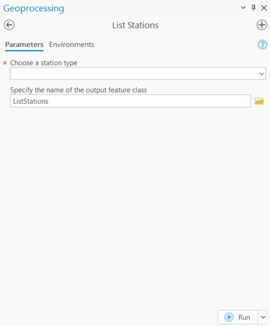
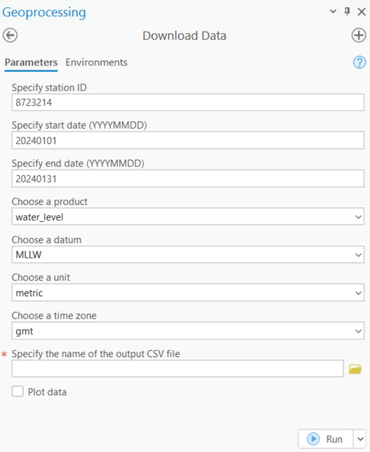

# noaa-coops-api-arcpro-addin
An ArcGIS Pro AddIn for NOAA CO-OPS Tides and Currents [Data](https://api.tidesandcurrents.noaa.gov/api/prod/) and [Metadata](https://api.tidesandcurrents.noaa.gov/mdapi/prod/) APIs. 

## ArcGIS Pro Version
This addin is compatible with ArcGIS Pro 3.4 and above.

## Features
This addin allows ArcGIS Pro users to quickly browse through [NOAA Tides and Currents stations](https://tidesandcurrents.noaa.gov/) by product type and download the specific data to CSV.

- Retrieve NOAA CO-OPS stations by station/product type.
- View station details with all available metadata.
- Download any data to CSV without data length limit.

## Installation

- Download the "coopsAPI.esriAddinX" file from the "AddIns" folder.
- Double click the AddIn file to install.

## Usage

- Open ArcGIS Pro
- Click on the "NOAA CO-OPS API" button in the Quick Access Toolbar
- Click on the "List Stations" button to browse stations by station type. After running this tool, a point feature class that contains all the metadata of the stations will be created in the current map.

- Click on the "Download Data" button to download the specific data to a CSV file.

## Acknowledgements

This project is partially sponsored by the Joint Airborne Lidar Bathymetry Technical Center of Expertise ([JALBTCX](https://jalbtcx.usace.army.mil/)). 
This package was developed by following the open source project [noaa_coops](https://github.com/GClunies/noaa_coops).
